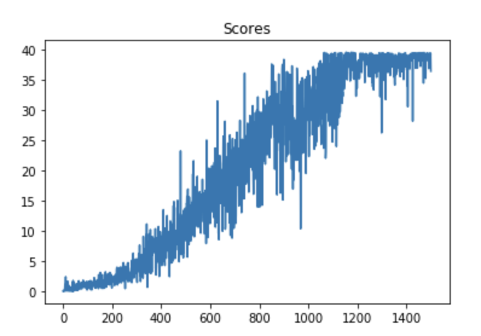

# Problem 2, continous control submision report

## Code Structure

At the root level of the repository, please, find the markdown files readme that will help you to install the environment.
In this report, we'll explain how the problem has been solved.

**Importan note: the github does not contain the Unity environment binaries!!! Please, see the readme file to see how to download it.**

we can also find some assets for the readme.

The root level also contains all the python files to code the agent and the rest of the required logic.

    - ddpg_model.py contains the Torch implementation of the neural networks that are being used in the project.

    - ddpg_agent.py Contains the core of the project, where we use the previously defined torch models to learn from the experiences. This code is based in the prevoius exercices of the module

    - train_agent.py does the training of the DDPG agent. It saves two different checkpoints during the training, the best one and the solved one. The script saves all the scores and losses using tensorboard, which is a requirement
    
    - test_agent.py is able to load a previously saved agent and test it (showing results in the terminal), saving the performance figures and showing the agent in the environment if the local system allows it.

## Learning Algorithm

    The selecte algorithm was DDPG  with its replay buffer and fixed Q Targets for actor and critic networks as the algo requires.

    Ornstein–Uhlenbeck process is used as a noise generator combined with 
    a linear epsilon greedy exploration/exploitation as the way to explore the state space.

    Soft Updates of the Actor and Critic models has been implemented as well

   **Highlevel pseudo-code of the algorithm**
   Init random weights for critic and actor.
   Clone weights to generate target critic and target actor.
   Init replay memory
    foreach episode
        Initialize a random process for action exploration (OU noise in this case)
        Get initial state

        for each step in episode:

            Choose an action using epsilon-greedy policy and exploration noise

            Take action and observe the reward and get next state

            Store the experience tuple in the replay buffer
            
            if we have enough experiences:

                Get a minibatch of tuples 

                Compute Q targets for current states (y_i) according to paper formula
                Compute expected Q (Q_expected) with critic_local
                Update critic (QNetwork) minimizing L2_loss(y_i, Q_expected)
                update actor policy using policy gradient
                Every C steps update Qtarget weights using Qvalues and tau for the soft-update

    **Hyperparameters**

    ```python
        
        EPS_START = 1.0         # Initial epsilon value (explore)
        EPS_END = 0.1           # Last epsilon value  (exploit)
        LIN_EPS_DECAY = 1e-6    # Noise decay rate
        BUFFER_SIZE = int(1e6)  # replay buffer size
        BATCH_SIZE = 128        # minibatch size
        GAMMA = 0.99             # discount factor
        TAU = 1e-3              # for soft update of target parameters
        LR_ACTOR = 1e-4         # learning rate of the actor
        LR_CRITIC = 1e-3        # learning rate of the critic
        WEIGHT_DECAY = 0        # L2 weight decay
        UPDATE_EVERY = 20       # skip some learn steps
    ```
    **Neural Networks**

    We have actor network, critic network and their target clones.
     
    The architecture is quite simple, multi-layer perceptron but decreasing layer after layer the number of neurons. Input layer matches the state size then we have 3 hidden fully connected layers and finaly the output layer.

    ```python
    Actor model initializated! Actor model summary:
    Actor(
    (fc1): Linear(in_features=33, out_features=256, bias=True)
    (fc2): Linear(in_features=256, out_features=128, bias=True)
    (fc3): Linear(in_features=128, out_features=64, bias=True)
    (fc4): Linear(in_features=64, out_features=4, bias=True)
    )
    Critic model initializated! Critic model summary:
    Critic(
    (fcs1): Linear(in_features=33, out_features=256, bias=True)
    (fc2): Linear(in_features=260, out_features=128, bias=True)
    (fc3): Linear(in_features=128, out_features=64, bias=True)
    (fc4): Linear(in_features=64, out_features=1, bias=True)
    )
    ```

   Each network has the implementation details mention in paper and course regarding weight initialization, action concatenation and soft-updates during the training.

## Plot of Rewards



The environment gets solved around 900 episodes with the specified Hyperparameters as the plot reflects.

## Ideas for Future Work

The agent needs a lot of episodes to solve the problem. Probably anothe network topology could work better. Implementing the Option 2: 20 agents would help as well to allow the model to converge faster due to parallel learning.

Other approaches like D4PG would solve the problem faster.
